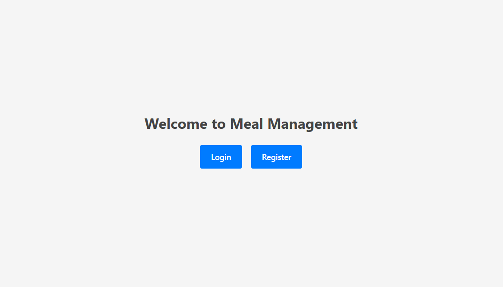
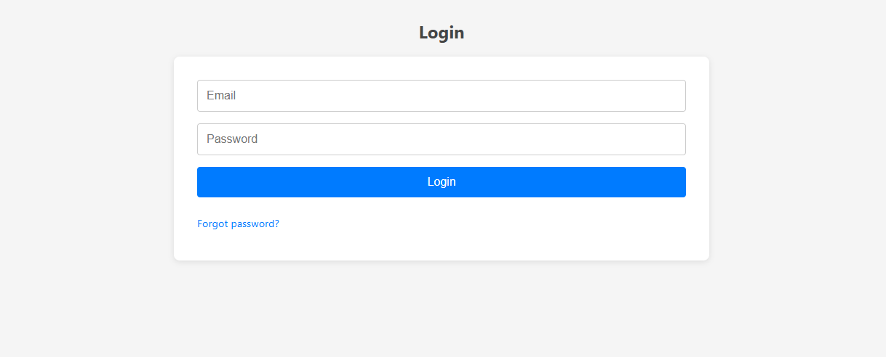
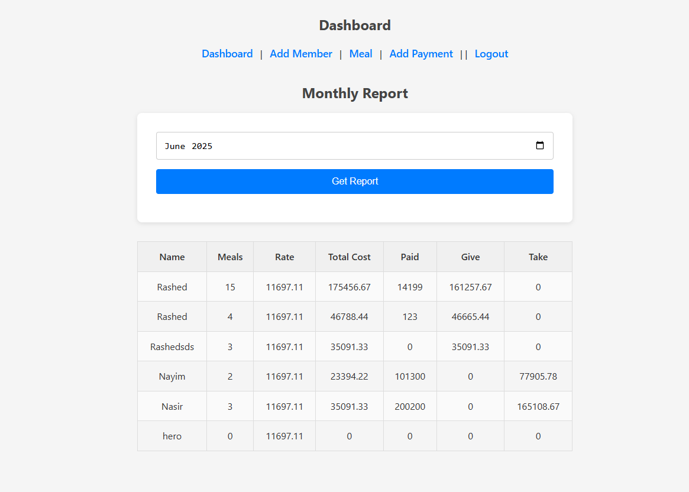
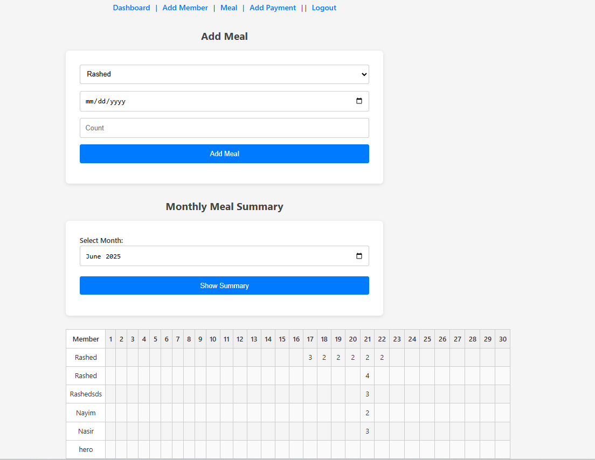

# Meal Management System

A simple meal‐management web app with JWT-based auth and password-reset via email. Track members, daily meals, payments, and generate monthly summaries—both financial and per-day meal counts.

---

## 🛠️ Tech Stack

- **Backend**: Python , Django , Django REST Framework  
- **Auth & Email**: djoser, djangorestframework-simplejwt, Gmail SMTP  
- **Database**: SQLite (default) or PostgreSQL  
- **Frontend**: HTML / CSS / JS (served from `frontend/`)  
- **Dependencies**: see [requirements.txt](#requirements)

---

## 🚀 Features

- **User**: register, login (JWT), logout  
- **Password Reset**: “forgot password” flow powered by varification code + Gmail SMTP  
- **Members**: CRUD member profiles  
- **Meals**: log daily meal counts per member  
- **Payments**: record bazaar/payments per member  
- **Monthly Report**:  
  - Financial report (meal rate, cost vs. paid, “give”/“take”)  
  - Daily meal‐count matrix  

---

## 💾 Installation

1. **Clone & venv**
   ```bash
   git clone https://github.com/your-org/meal-management.git
   cd meal-management
   python3 -m venv .venv
   source .venv/bin/activate

2. **Install deps**
   pip install -r requirements.txt

3. **Enviroment**
   Create a .env in project root:

   EMAIL_HOST_USER=you@gmail.com

   EMAIL_HOST_PASSWORD=app-password

   DEFAULT_FROM_EMAIL=you@gmail.com

4. **Database & Migrations**
   ```bash
   python manage.py migratre
   python manage.py makemigrations
   
5. **open front end**
  http://127.0.0.1:5500/frontend/
  
